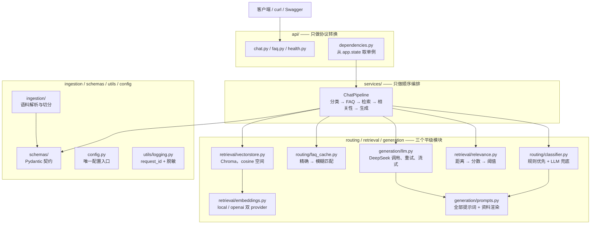
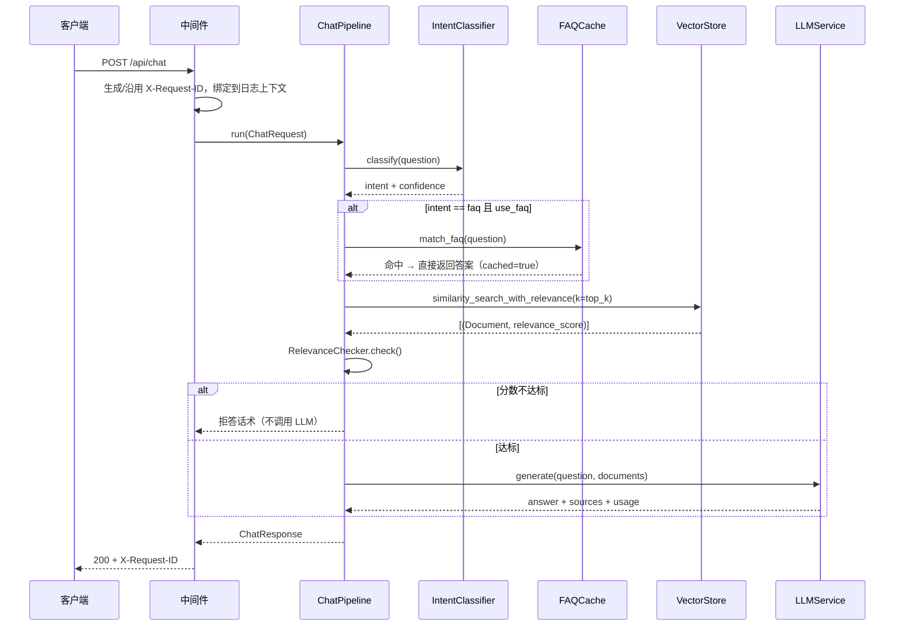

# 架构说明

本文说明系统的**模块划分、依赖方向与关键取舍**。流程图见 [rag-flow.md](./rag-flow.md)，
接口细节见 [api.md](./api.md)。

## 1. 整体分层

**依赖方向是单向的**：`api → services → routing / retrieval / generation → schemas / utils / config`。
下层不反向依赖上层。这条规则有实际后果，不是洁癖：

- `retrieval/relevance.py` 需要 LLM 复核时，**不导入** `generation/llm.py`，而是接收一个
  `judge` 回调——否则检索层就依赖了生成层，"换生成模型"会变成"改检索层"；
- `routing/classifier.py` 需要 LLM 分类时，同样只接收 `Callable[[str], str]`，真实实现在
  `services/pipeline.py` 里装配时才注入。

**一处需要说明的例外**：`routing/classifier.py` 会 `from src.generation.prompts import
INTENT_CLASSIFIER_PROMPT`——它引用的是 generation 包里的**提示词常量**（一个纯字符串），
不含任何模型调用。这样做的理由是提示词只能有一个出处；代价是 `generation.prompts` 的
导入会被 routing 层带起来（所以该模块刻意保持零重依赖）。

## 2. 模块职责

| 模块 | 职责 | 明确不做的 |
| --- | --- | --- |
| `api/` | 路由、请求校验、SSE 分帧、异常 → 状态码 | 任何业务判断（阈值、分支、提示词） |
| `services/pipeline.py` | 决定"按什么顺序调用谁、在哪一步提前返回" | 复述分类规则、打分逻辑 |
| `routing/classifier.py` | 规则优先的意图分类 | 检索、生成、FAQ 数据 |
| `routing/faq_cache.py` | FAQ 的加载 / 匹配 / 保存 | 决定"未命中怎么办" |
| `retrieval/embeddings.py` | 按配置产出 Embedding 实现 | 与 LLM 耦合（DeepSeek 不提供 embedding） |
| `retrieval/vectorstore.py` | Chroma 读写、cosine 空间守卫 | 相关性判断 |
| `retrieval/relevance.py` | 距离 → 统一分数 → 阈值判定 | 生成任何自然语言 |
| `generation/prompts.py` | **全部**提示词文本 + 资料渲染 | 调用模型 |
| `generation/llm.py` | 调用 DeepSeek、超时、重试、流式、token 统计 | 认识"课程/FAQ"这些业务概念 |
| `ingestion/` | 语料 → 结构化 Document | 切分之外的任何后处理 |
| `schemas/` | 跨模块的数据契约 | 任何 I/O |

## 3. 请求生命周期

**单例在 lifespan 里建一次**：Chroma 连接、Embedding 模型、LLM 客户端、FAQ 缓存都是
"有状态且构建昂贵"的对象（模型加载约 5 秒）。`src/main.py` 的 lifespan 调用
`build_pipeline()` 组装一次，挂在 `app.state`，由 `api/dependencies.py` 取给路由函数。
所有构造都是**惰性**的：启动时不连 Chroma、不加载模型、不建 HTTP 客户端，所以启动很快、
缺 API Key 也能起服务（`/api/health` 与 FAQ 快路径照常工作）。

## 4. 关键取舍

### 4.1 Embedding 与 LLM 完全解耦

DeepSeek 只提供对话模型，不提供 Embedding。因此 `retrieval/embeddings.py` 通过
`EMBEDDING_PROVIDER` 在 `local`（HuggingFace，默认）与 `openai`（任意兼容接口）之间切换，
与 `generation/llm.py` 没有任何共享配置。换 Embedding 不会碰到 LLM 配置，反之亦然。

### 4.2 距离空间被钉死为 cosine，并做启动守卫

这是全项目最容易出错、且**错了不会报错**的一环。实测（见 `retrieval/relevance.py` 的模块
文档）Chroma 在不指定 `hnsw:space` 时返回的是**平方欧氏距离**：

| 集合配置 | 文档 A (cos=1.0) | 文档 B (cos=0.7071) | 文档 C (cos=0.0) |
| --- | --- | --- | --- |
| 不指定（默认） | 0.0 | 0.5858 | 2.0 |
| `hnsw:space = "cosine"` | 0.0 | **0.2929** | 1.0 |

所以向量库显式写入 `hnsw:space = cosine`，`VectorStore` 打开集合后会**核对**实际空间，
不一致直接抛异常——否则阈值会全错，而检索结果看起来"有结果"，没人会发现。
`RelevanceChecker` 还有第二道守卫：分数超出 `[0,1]` 时拒绝，用来拦住"把原始距离当分数传"。

### 4.3 FAQ 在 RAG 之前，但只有 FAQ 能短路 LLM 分类

意图分类分两层：零成本的规则层（关键词 / 课号正则）与一次网络调用的 LLM 分类。
**只有 FAQ 类规则能在高置信度下跳过 LLM**——因为 FAQ 的最终判定不是关键词，而是
`FAQCache` 的精确/模糊匹配；关键词只决定"要不要去翻这本册子"。`course_query` /
`process_query` 没有这道高精度兜底，所以规则命中只作候选，最终由 LLM 定夺。

### 4.4 提示词只有一个出处

所有模板（RAG 系统提示词、用户提示词、意图分类、相关性复核、忠实度评判）都在
`generation/prompts.py`。路由层用的分类提示词也从这里引用同一个常量，而不是复制文本——
复制两份的典型故障是"改了一处、线上没变，且不报错"。

### 4.5 失败方向朝向检索

分类失败（LLM 不可用、响应不可解析）时退到规则候选，再不行退到 `course_query`（去检索），
**绝不退到 `chitchat`**；规则候选里只有寒暄命中时，该候选被丢弃。理由：把正经的课程问题
答成一句问候，比答得不准糟得多。

## 5. 数据契约

| 契约 | 位置 | 说明 |
| --- | --- | --- |
| `Course` / `Assessment` | `schemas/course.py` | 语料的结构化模型，同时负责渲染正文与 metadata |
| `ChatRequest` / `ChatResponse` | `schemas/chat.py` | 对外接口的请求/响应 |
| `Source` / `TokenUsage` / `GenerationResult` | `schemas/chat.py` | 来源、token 用量、生成结果 |
| `IntentType` | `schemas/chat.py` | 四类意图；同时是响应字段，故放在契约层 |
| `Document`（LangChain） | 贯穿全链路 | 检索与生成之间的事实标准 |

`Document.metadata` 只允许标量（Chroma 的硬约束），由 `Course.to_metadata()` 统一保证；
每条文档都带 `course_id` / `name` / `source` / `section_title` / `type`，回答的引用与
来源列表都从这里来。

## 6. 配置

所有配置集中在 `src/config.py`（业务代码禁止 `os.getenv`）。分组与用途见 README 的
「环境变量」一节。三条约定：

1. **写错在启动时就报**（Pydantic 校验），而不是运行到一半才炸；
2. **密钥用 `SecretStr` 包装**，避免被日志或异常堆栈打印；
3. **可调参数一律给"为什么是这个默认值"**，例如 `RELEVANCE_THRESHOLD=0.50` 是在本项目
   语料上实测标定的，换 Embedding 模型必须重新标定。
